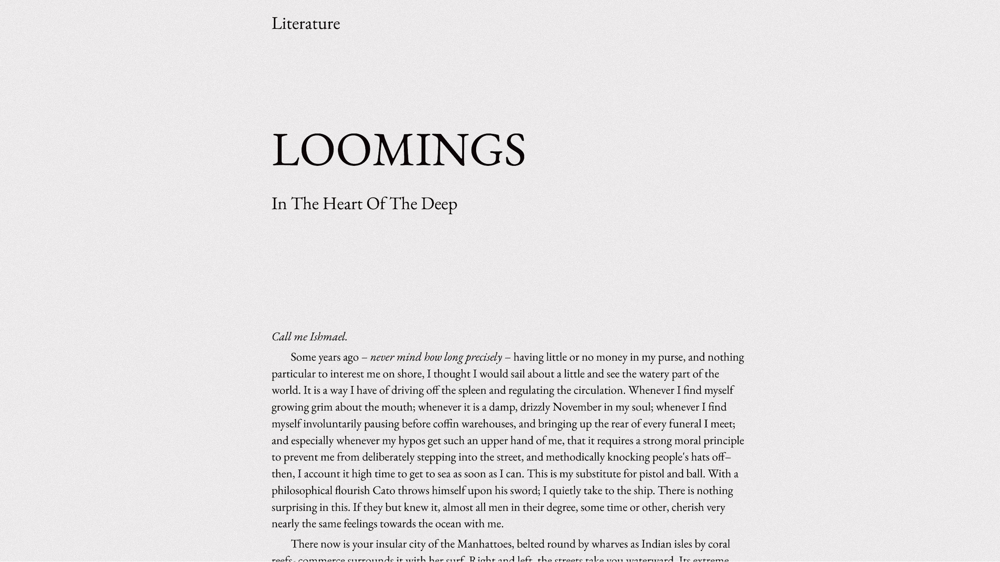

# Melville

**Melville** is a clean and timeless HTML/CSS template inspired by classic literature. Perfect for minimal blogs, portfolios, or projects that prioritize thoughtful design and content.

## Screenshot


## Features

- Minimalistic and elegant design
- Fully responsive and mobile-friendly
- Customization possible (via CSS variables)

## Installation

1. Clone the repository:
   ```bash
   git clone https://github.com/your-username/melville.git
